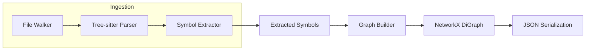

# Architecture

## Current (Phase 1-2)

## Modules
- `codeintel/file_walker.py`: Locates Python files under a target root.
- `codeintel/parser.py`: Tree-sitter parsing wrapper.
- `codeintel/extract.py`: AST traversal + symbol extraction.
- `codeintel/models.py`: Dataclasses for symbol output.
- `codeintel/graph.py`: NetworkX graph builder and schema.
- `codeintel/storage.py`: JSON save/load helpers for the graph.
- `codeintel/pipeline.py`: End-to-end graph build pipeline and CLI entrypoint.
- `frontend/`: Static browser-based graph viewer (Cytoscape).

## Planned (Future Phases)
- Graph construction and JSON serialization via NetworkX.
- MCP server with dependency and impact tools.
- Partner integrations (Lovable, CodeWords, Dust).
