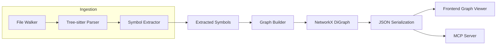

# Architecture

## Current (Phase 1-4)

## Modules
- `codeintel/file_walker.py`: Locates Python files under a target root.
- `codeintel/parser.py`: Tree-sitter parsing wrapper.
- `codeintel/extract.py`: AST traversal + symbol extraction.
- `codeintel/models.py`: Dataclasses for symbol output.
- `codeintel/graph.py`: NetworkX graph builder and schema.
- `codeintel/storage.py`: JSON save/load helpers for the graph.
- `codeintel/pipeline.py`: End-to-end graph build pipeline and CLI entrypoint.
- `codeintel/mcp_graph.py`: Graph query service powering MCP tools.
- `codeintel/mcp_server.py`: MCP server exposing graph tools over stdio/HTTP.
- `codeintel/migration.py`: Migration plan generator (OpenRouter + graph context).
- `codeintel/workflow_mining.py`: Workflow mining artifacts (OpenRouter + graph context).
- `codeintel/openrouter_client.py`: OpenRouter HTTP client helper.
- `codeintel/llm_utils.py`: Shared LLM response parsing and JSON repair helpers.
- `codeintel/api.py`: FastAPI server for graph generation from uploaded archives.
- `frontend/`: Static browser-based graph viewer (Cytoscape).

## Planned (Remaining)
- Partner integrations (CodeWords, Dust) and end-to-end PR workflow demo.
