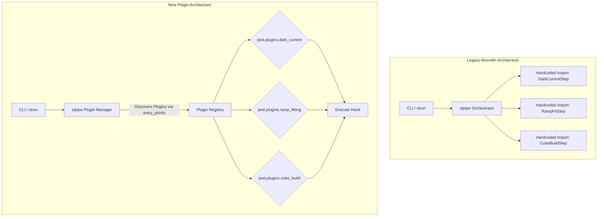
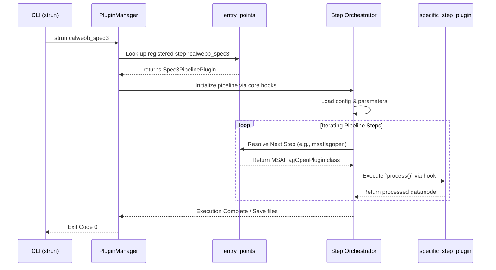

# JWST Pipeline Migration to Plugin Architecture

## Summary

Migrate the core execution framework and step orchestration of the standard JWST pipeline to a dynamic, plugin-based architecture using Python 3.12. This will decouple individual steps from the monolithic core while preserving strict command-line equivalence and scientific output bit-for-bit.

**Target stack:** Python 3.12 + plugin system  
**Scope:** Core pipeline execution + step orchestration  
**Constraints:** Maintain current outputs; minimize downtime; keep CLI behavior identical.

---

## Key Assumptions

- The target environment natively supports Python 3.12.
- The current regression test suite has full coverage over standard pipeline runs (e.g., calwebb_spec3).
- A standard plugin framework (e.g., pluggy or `importlib.metadata` entry points) will be utilized.
- Existing CLI parameters and input configuration (e.g., ASDF/FITS configs) will remain unchanged.

---

## Scope (Detailed)

Core pipeline execution and step orchestration. This includes refactoring the base `Step` architecture inside `jwst.stpipe` and updating all inherited step modules (e.g., `DarkCurrentStep`, `RampFitStep`, `CubeBuildStep`) into discoverable plugins.

---

## Migration Phases

### Phase 1: Plugin Architecture Foundation

**Goal:** Establish the exact plugin spec and adapt the base `Step` mechanisms.

**Steps:**

1. Upgrade base environment to Python 3.12 and update dependencies.
2. Introduce the plugin manager (e.g., pluggy or native PEP 621 entry points) to the core orchestrator in `jwst.stpipe.core`.
3. Define hook specifications for Pipeline initialization, Step execution, Pre-hook, and Post-hook phases.
4. Modify the base `class Step` to proxy execution calls to discovery hooks when appropriate, ensuring no regressions on internal inheritance.

**Deliverables:**

- Plugin specification defined.
- Modified pipeline core code handling dynamic plugin discovery.
- Unit tests for generic plugin loader.

**Checks:**

- Core builds securely on Python 3.12.
- Dummy step can be completely handled and executed via the new architecture.

---

### Phase 2: Incremental Step Migration

**Goal:** Migrate functional `Step` subclasses into individual registered plugins.

**Steps:**

1. Tag a robust sub-pipeline (e.g., Guider CDS or simpler level 2 steps) for pathfinding.
2. Extract steps like `DarkCurrentStep`, `PictureFrameStep`, `RefPixStep`, and register them using the new entry_point config in `pyproject.toml`.
3. Refactor imports where code directly expects hardcoded step classes.
4. Continue migrating analytical steps (`CubeBuildStep`, `RampFitStep`, `OutlierDetectionStep`, `Extract2dStep`, and core Step integrations).

**Deliverables:**

- All Step implementations decoupled and refactored as independent plugins.
- Updated `jwst` step resolution dictionary mapping old names/classes to the new plugins.

**Checks:**

- Each isolated step plugin passes its individual test suite (e.g., `test_guider_cds.py`, `test_cube_build.py`).
- Legacy static import warnings generated where applicable.

---

### Phase 3: Integration & Compatibility Layer

**Goal:** Ensure 100% CLI-identical behavior and legacy output preservation.

**Steps:**

1. Map standard CLI entry points (`strun`) and string command execution patterns to the plugin registry.
2. Implement a backward-compatibility layer so that scripts calling `from jwst.pipeline import calwebb_spec3` still function, internally routing via the proxy.
3. Validate ASDF reference file fetching within the new decoupled plugin structure.

**Deliverables:**

- Enhanced CLI wrapper passing inputs to dynamically loaded pipeline hooks.
- Full integration of persistence layer plugins.

**Checks:**

- `strun` commands with existing configuration parameters map correctly.
- Automated regression CI confirms pixel-for-pixel output holds.

---

### Phase 4: Full Validation & Deployment

**Goal:** Comprehensive end-to-end testing and code standardization.

**Steps:**

1. Run parallel suite across full test data (e.g., `test_calwebb_spec3.py`, `test_miri_lrs_slit_spec3.py`).
2. Profile plugin resolution for unwanted execution latencies.
3. Finalize documentation for creating custom third-party step plugins.

**Deliverables:**

- Optimized plugin pipeline.
- Documentation for developers on building JWST plugins.

**Checks:**

- No drop in test coverage.
- Pipeline performance within ~5% of legacy baseline.

---

## Risks

- **Plugin lifecycle:** Unexpected memory leaks or lifecycle issues from dynamic module imports via entry points.
- **Config validation:** Subtle failures in `stpipe` config validation if parameter inheritance is altered during refactor.
- **State leakage:** Cross-contamination between steps if the orchestrator does not clean up dynamically loaded plugin instances.
- **Latency:** Unexpected plugin instantiation latency vs in-memory monolith caching.
- **Reference overrides:** Missing internal reference overrides during pipeline persistence.
- **Error handling:** Silent failures if error-handling schemas are improperly wrapped in pipeline hooks.

---

## Validation Methods

- Run `jwst.stpipe.tests.test_pipeline` and compare outputs to baseline.
- Run `test_calwebb_spec3` in a clean environment to verify pipeline flow.
- Verify CLI arguments unchanged via shell scripts parameterized as legacy inputs.
- Confirm bit-for-bit equivalence of output `.fits`/`.cal` files vs unmigrated execution.

---

## Migration Checklist

- [ ] Set up base Python 3.12 environment
- [ ] Draft plugin spec and replace exact matching inside `stpipe.core`
- [ ] Refactor `Step` base class from monolithic instantiation to plugin interface
- [ ] Migrate detector-level steps (Dark Current, Picture Frame, Fringe, DQ Init)
- [ ] Migrate spatial/spectral steps (Extract1d/2d, Cube Build, Resample)
- [ ] Migrate orchestration steps (calwebb_spec3, master background)
- [ ] Implement CLI adapter/proxy ensuring CLI stability
- [ ] Execute parallel end-to-end tests vs legacy reference files
- [ ] Document "How to write a custom JWST Pipeline Step"

---

## Architecture Visualizations

### Pipeline Architecture: Monolithic vs Plugin Flow

### Sequence: Execution of an Orchestrated Step Plugin

---

*Generated via `migration_plan` MCP tool (OpenRouter + Gemini 3.1), goal: Migrate JWST pipeline to plugin-based architecture; scope: Core pipeline execution + step orchestration.*
