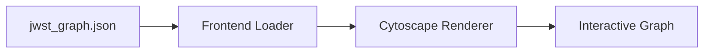

# Frontend Viewer

A static browser-based viewer for the JWST knowledge graph JSON produced by `codeintel.pipeline`.

## Data Flow



## Usage

1. Build the graph JSON from the repo root.
2. Start a local HTTP server from the repo root.
3. Open `/frontend/` in the browser.

```powershell
.\.venv\Scripts\python -m codeintel.pipeline --root C:\Users\anshu\legacy-profen\jwst-main --output jwst_graph.json
python -m http.server 8000
```

Then browse to:

```
http://localhost:8000/frontend/
```

## Workflows Tab

Generate workflow artifacts with OpenRouter and load them in the Workflows tab.

```powershell
.\.venv\Scripts\python -m codeintel.workflow_mining --graph jwst_graph.json --output workflow_artifacts.json --max-workflows 6 --hops 2 --openrouter-key-file openrouter.txt
```

Then open the Workflows tab and click **Load Workflows**. The viewer loads `../workflow_artifacts.json` by default.

## Controls
- Filter node types and edge types.
- Subgraph focus by module group or class, plus automatic neighborhood context.
- Focus + context lens with configurable hop radius.
- Expand neighborhoods from a selected node to reveal more of the graph.
- Cluster detection (connected components) with optional color-by-cluster.
- Core logic mode to suppress externals and highlight high-degree internal nodes.
- Search by node name or id.
- Click nodes to inspect details.
