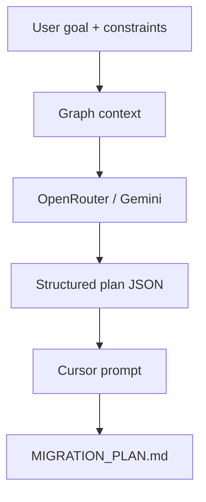

# Migration Planning Tool

The MCP server exposes a `migration_plan` tool that uses OpenRouter to generate a high-quality migration plan grounded in the graph context.

## Flow



## Environment

- `OPENROUTER_API_KEY`: API key for OpenRouter.
- `OPENROUTER_MODEL`: Model name (e.g. Gemini on OpenRouter).
- `OPENROUTER_APP_TITLE`: Optional app name used in headers.
- `OPENROUTER_APP_URL`: Optional app URL used in headers.

You can set these in `cursor_mcp.json` for Cursor-based runs.

## Example MCP Call

```json
{
  "tool": "migration_plan",
  "arguments": {
    "goal": "Migrate JWST pipeline to a plugin-based architecture",
    "target_stack": "Python 3.12 + plugin system",
    "scope": "Core pipeline execution and step orchestration",
    "constraints": ["Maintain current outputs", "Minimize downtime"],
    "seed_queries": ["jwst", "Step"],
    "outline_only": true,
    "plan_filename": "MIGRATION_PLAN.md"
  }
}
```

## Troubleshooting

- If you see `400 Bad Request`, verify the model name against the OpenRouter Models API and choose a valid model ID.
- Some models may not support `response_format`; the tool will retry without JSON mode when it detects a 400 error.
- If the model returns invalid JSON, the tool attempts a repair pass. You can also set `outline_only` or rely on `plan_markdown_lines` to avoid escaping issues.
