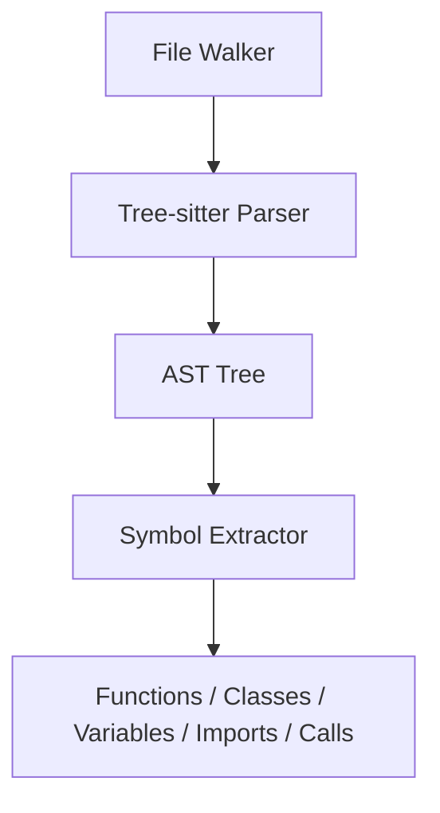

# Phase 1: Setup and AST Ingestion

This phase establishes the local Python parsing pipeline for the JWST codebase and validates it with unit tests.

## Pipeline Overview

## Notes
- File walking targets Python files under `/jwst-main`.
- Tree-sitter generates a concrete syntax tree; extraction interprets structure into symbols.
- Imports are parsed via Python `ast` on the import node text to normalize names.

## Phase 1 Deliverables
- File walker with exclude rules for common virtualenv and VCS directories.
- Tree-sitter based parser for Python.
- Symbol extractor for functions, classes, variables, imports, and calls.
- Tests verifying extraction results.