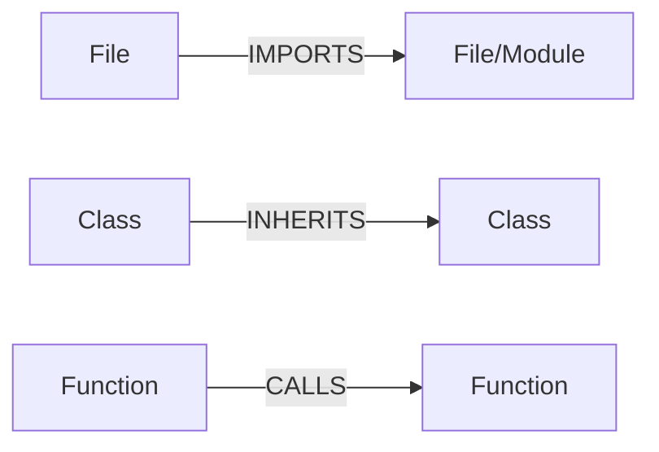
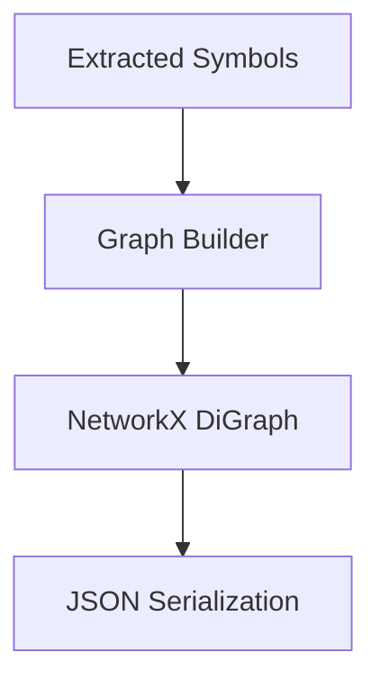

# Phase 2: Knowledge Graph Construction

Phase 2 builds a NetworkX `DiGraph` from extracted symbols and provides JSON serialization to avoid re-parsing the JWST codebase on every run.

## Graph Schema



## Data Flow



## Phase 2 Deliverables
- NetworkX-based graph schema implementation.
- Ingestion pipeline mapping extracted symbols to nodes and edges.
- JSON serialization (save/load) using `node_link_data`.
- Tests for graph construction and serialization round-trip.

## Build Graph From Repo (No MCP)

```powershell
.\.venv\Scripts\python -m codeintel.pipeline --root C:\Users\anshu\legacy-profen\jwst-main --output jwst_graph.json
```
