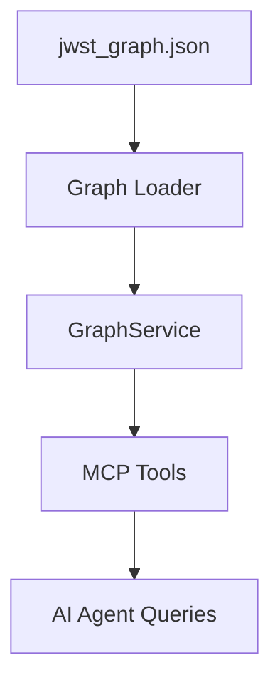

# Phase 3: MCP Server

Phase 3 exposes the in-memory graph over MCP so AI agents can query dependencies, impacts, and paths.

## MCP Tooling



## Tools
- `metadata`: snapshot info (timestamp, counts, path).
- `search`: find nodes by name, qualname, or path.
- `get_dependencies`: incoming/outgoing dependency queries.
- `impact_analysis`: upstream blast radius for changes.
- `graph_path`: shortest path between nodes.
- `subgraph`: bounded neighborhood around a node.
- `stats`: hubs, clusters, module breakdowns.
- `migration_plan`: OpenRouter-powered migration plan generation.

## Run (stdio)

```powershell
.\.venv\Scripts\python -m codeintel.mcp_server --graph jwst_graph.json --transport stdio
```

## Run (HTTP)

```powershell
.\.venv\Scripts\python -m codeintel.mcp_server --graph jwst_graph.json --transport streamable-http --host 127.0.0.1 --port 8001
```

## Migration Tool Docs

See `docs/migration-tool.md` for usage and environment variables.

## Smoke Test (stdio)

```powershell
.\.venv\Scripts\python scripts\mcp_smoke.py --graph jwst_graph.json
```
