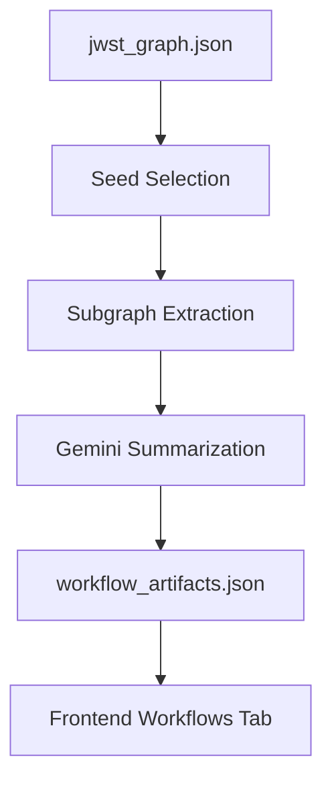

# Workflow Mining

This phase extracts business workflows from the JWST code graph and renders them for non-technical stakeholders.

## Flow



## Artifacts
- `workflow_artifacts.json`: leadership-friendly workflow cards with Mermaid diagrams and supporting nodes.

## Generate Artifacts

```powershell
.\.venv\Scripts\python -m codeintel.workflow_mining --graph jwst_graph.json --output workflow_artifacts.json --max-workflows 6 --hops 2 --openrouter-key-file openrouter.txt
```

Key file formats accepted:
- Raw API key string on one line.
- `.env` style line like `OPENROUTER_API_KEY=sk-...` (quotes optional).

## What Leaders See
- Workflow cards with summaries, risks, inputs/outputs.
- Mermaid diagrams for process visualization.
- Supporting nodes list for traceability back to code.
